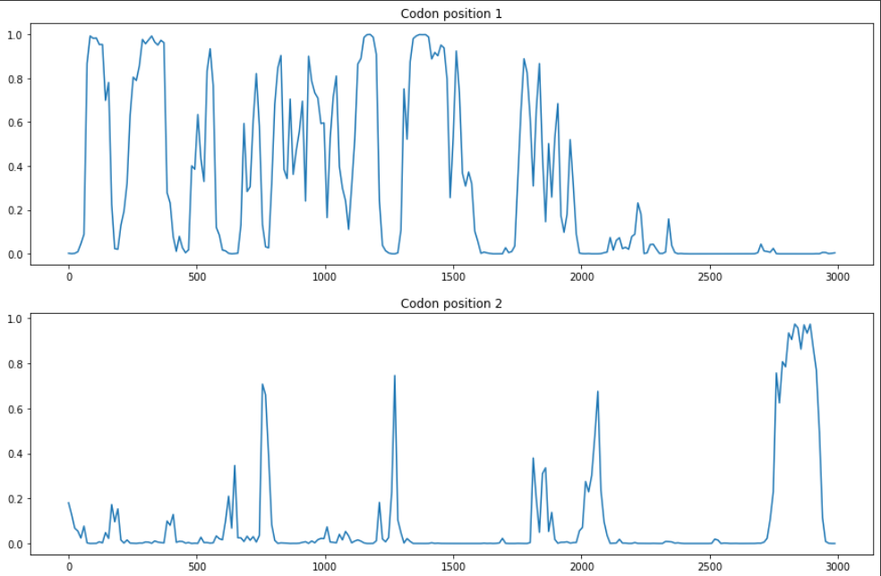

# hse22_hw3
Седых Александр Группа 2
## Основное задание
[Работа, выполненная в google colab](https://colab.research.google.com/drive/160ZPlXuc2G7oBA9XLlUS65ltL8GDQIx-?usp=sharing)
***
Проиводим расчёт верояности кодирования в трёх рамках для участка ДНК:
1. Длина участка ДНК ~ 3кб.
2. Размер окна - 96.
3. Шаг - 12.
Построим графики по вычислениям:

